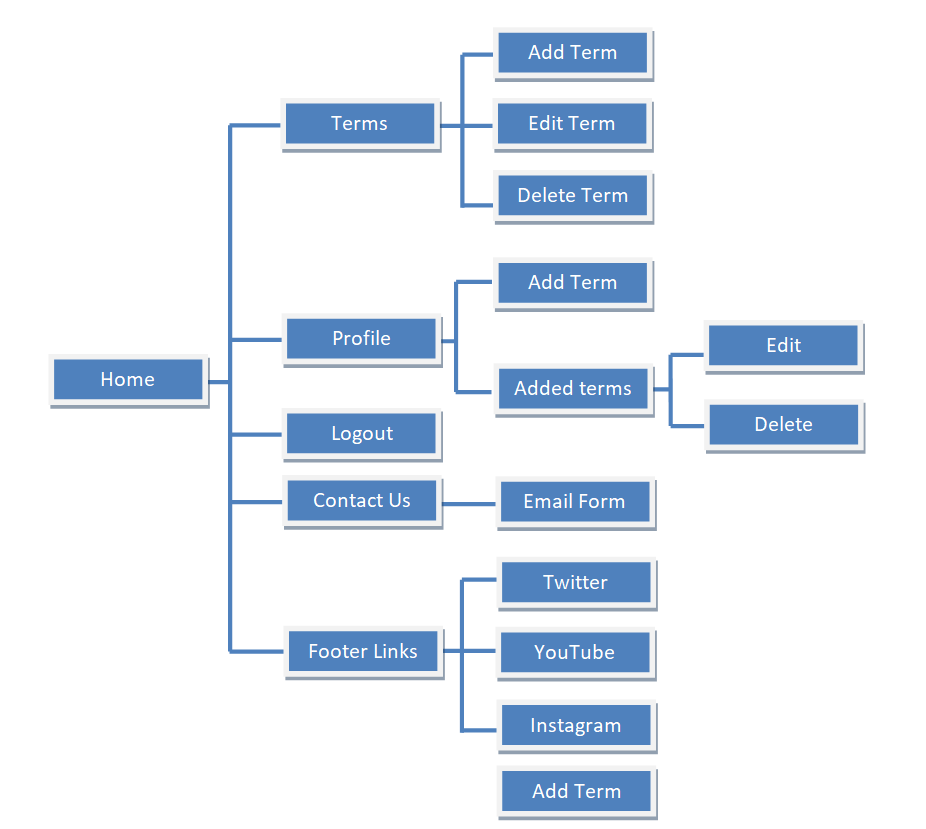
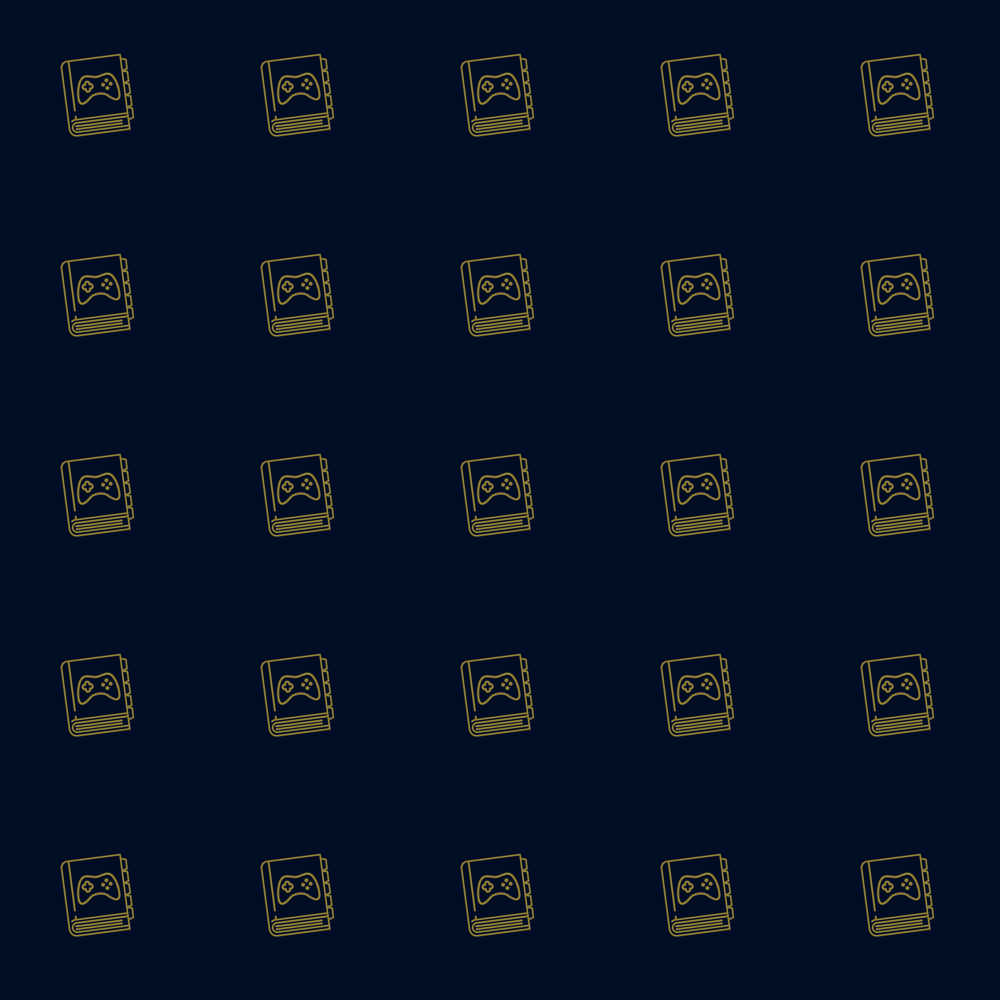

<h1 align="center">The Gamersaurus</h1>

[View a live version of the site here.](https://gamersaurus-joeyy.herokuapp.com/)

I have created this project (Milestone project 3) as part of my Full Stack Web Development course with [Code Institute](https://codeinstitute.net/).

The Gamersaurus is a community built thesaurus on terms you would most likely encounter in the gaming world.

| _Am I Responsive screenshot_ |
|:----------------------------:|
|  |

---

## Contents

- [**User Experience Design (UXD)**](<#user-experience-design>)

  - [Project Goals](<#project-goals>)
  - [Content Requirements](<#content-requirements>)
  - [Importance and Feasibility chart](<#importance-and-feasibility-chart>)
  - [User Stories](<#user-stories>)
  - [Website Structure](<#website-structure>)
  - [Design Decisions from UXD](<#design-decisions-from-uxd>)
    - Colour Scheme
    - Images
    - Typography
  - [Wireframes](<#wireframes>)
  - [Design Changes](<#design-changes>)

- [**Database Schema**](<#database-schema>)

- [**Features**](#features)

- [**Technologies**](#technologies)

- [**Testing**](#testing)

- [**Deployment**](#deployment)

- [**Credits**](#credits)
  
  ___

## User Experience Design

### Project Goals

The goal of this project is to create an online thesaurus of the different slang and abbreviations you would come across in the gaming world. Each term in the thesaurus will have a description, example and who submitted the term.

### Content Requirements

The main points I want to achieve with this project are:

+ To provide users with an online thesaurus about Gamer terms.
+ To showcase my skills as a web developer using HTML, CSS, JavaScript and Python.
+ To showcase my skills using MongoDB, Heroku and Flask.
+ To help users understand and collate all the words and phrases used by gamers.

### Importance and Feasibility chart

Opportunity/Problem | Importance | Viability/Feasibility
:-------- |:--------:|:--------:
A. Users able to login  | 5 | 5
B. Users can submit terms | 5 | 5
C. Users are notified of their actions | 5 | 4
D. Users can view 3 most recents | 3 | 3
E. User can search for terms | 4 | 4

### User stories

+ #### User goals

    + As a **user**, I want to be able to view all the terms currently added.
    + As a **user**, I want to understand the main purpose of the site.
    + As a **user**, I want to be able to intuitively navigate through the site.
    + As a **user**, I want to be able to make my own account and submit terms to the site.
    + As a **user**, I want to be able to contact the site owner with any queries I have regarding the site.

+ #### Registered User Goals

    + As a **registered user**, I want to be able to log in and out of my account.
    + As a **registered user**, I want to be able to submit terms of my own to the site.
    + As a **registered user**, I want to be able to edit any terms I have submitted to the site.
    + As a **registered user**, I want to be able to delete any terms I have submitted to the site.

+ #### Site Owner Goals

	+ As a **site owner**, I want to provide the user with the essential information required to understand the site's purpose.
	+ As a **site owner**, I want the user to be able to navigate to other areas of the site.
	+ As a **site owner**, I want the user to be able to view the thesaurus without having an account.
	+ As a **site owner**, I want the user to be able to seemlessly make an account and submit terms to the site.
	+ As a **site owner**, I want the user to be able to edit and delete terms they have added.
	+ As a **site owner**, I want to include links to the associated socials for the product.

### Website Structure

Due to a design change the "Thesaurus" link is now called Terms.

Structure of the website whilst not being logged in:


Structure of the website whilst being logged in:



###  Design Decisions from UXD

#### Colour Scheme


Using a combination of [coolors.co](https://coolors.co/) and [Accessible Color Generator Tool](https://learnui.design/tools/accessible-color-generator.html) I was able to create a colour scheme that uses contrasting blues and yellows to convey the majority of the content as it matches the colours used in the Gamersaurus logo. The colour scheme will remain consistent throughout the buttons, the overall design of the site and where information is presented back to the user based on their actions.

+ #000D24 - Dark blue from logo that makes up the background colours.
+ #F3CA40 - Yellow colour from logo which will be used for titles and outlines.
+ #FCF7F8 - Whitish colour used for the main bodies of text in the site.
+ #C0960C - A darker yellow colour to use as hover states.

I tested my colour contrasts against the AAA guidelines using [this tool](https://learnui.design/tools/accessible-color-generator.html) as mentioned in my technologies section. I have included a picture below as proof:


#### Images

**Logo image**:


**Background image**:



+ This is a logo I created myself using GIMP and 2 icons from [Flat Icon](https://www.flaticon.com). I used the colour from inside the book as a background for the tileable image.
+ The two icons I used were Dictionary [here](https://www.flaticon.com/free-icon/big-dictionary_85601?term=dictionary&page=1&position=1&page=1&position=1&related_id=85601&origin=search) and Controller [here](https://www.flaticon.com/free-icon/console_686589?term=controller&page=1&position=2&page=1&position=2&related_id=686589&origin=search).

#### Typography

Throughout the site two main fonts will be used. Headers and titles will use [SchoolBell](https://fonts.google.com/specimen/Schoolbell?query=c&category=Handwriting&preview.text=Gamersaurus&preview.text_type=custom) and associated text will use [Rock Salt](https://fonts.google.com/specimen/Rock+Salt?category=Handwriting&preview.text=Gamersaurus&preview.text_type=custom&query=rock+salt).

The SchoolBell font was chosen as it resembles handwriting on a school white board which is associated with learning and I felt it an appropriate fit for the purpose of the site. Rock Salt was chosen as a complimentary font as Google suggested it as a popular pairing with SchoolBell and it provides a non obtrusive font to display information in the thesaurus.

### Wireframes

| Mobile | Tablet |  PC  |
| :----: |:-----: | :--: |
| [index.html](wireframes/mobile/index-mobile.png) | [index.html](wireframes/tablet/index-tablet.png) | [index.html](wireframes/pc/index-pc.png) |
| [terms.html](wireframes/mobile/thesaurus-mobile.png) | [terms.html](wireframes/tablet/thesaurus-tablet.png) | [terms.html](wireframes/pc/thesaurus-pc.png) |
| [register.html](wireframes/mobile/register-mobile.png) | [register.html](wireframes/tablet/register-tablet.png) | [register.html](wireframes/pc/register-pc.png) |
| [login.html](wireframes/mobile/login-mobile.png) | [login.html](wireframes/tablet/login-tablet.png) | [login.html](wireframes/pc/login-pc.png) |
| [profile.html](wireframes/mobile/profile-mobile.png) | [profile.html](wireframes/tablet/profile-tablet.png) | [profile.html](wireframes/pc/profile-pc.png) |
| [contact.html](wireframes/mobile/contact-mobile.png) | [contact.html](wireframes/tablet/contact-tablet.png) | [contact.html](wireframes/pc/contact-pc.png) |
| [404.html](wireframes/mobile/404-mobile.png) | [404.html](wireframes/tablet/404-tablet.png) | [404.html](wireframes/pc/404-pc.png) |
| [Add/Edit Term](wireframes/mobile/addword-mobile.png) | [Add/Edit Term](wireframes/tablet/addword-tablet.png) | [Add/Edit Term](wireframes/pc/addword-pc.png) |

### Design Changes

+ **Duplicate Gamersaurus link** - I was originally going to include a "Gamersaurus" link in the nav bar but opted to remove it to save screen space and remove redundancy as the logo redirects to the same link.
    + Further into the development of this project I decided to make the brand logo and title redirect to ```index.html``` and added "Terms" link to the nav links for a redirect to ```terms.html```.

## Database Schema

I decided to use MongoDB Atlas as as cloud database service to create and store the data collections associated with this project. I have set the database up as follows:

MongoDB Atlas was the cloud database service used to create and store the database collections for this project:

### Dictionary Collection

|       Key     |         Value          |
| :-----------: | :--------------------: |
| _id:          | ObjectId("unique_id")  |
| term:         |        "string"        |
| definition:   |        "string"        |
| example:      |        "string"        |
| submitted_by: |        "string"        |


### User Profile Collection

| Key | Value |
| :---: | :---: |
| _id: | ObjectId("unique_id") |
| username: | "string" |
| password: | "string" |


#### [Back to top](#contents)

---

## Features

### Existing Features

The header and footer can be accessed and viewed throughout all pages in the site as they are within **base.html** which all other pages extend from.

Included in the **header** is: 

+ **Brand Icon and Name**: Provides a link to the Gamersaurus to allow the user to view it at any point.
+ **Nav Links**: Provides a way for the user to view the other pages on the site.
    + If the user is not logged in they will see Home, Login, Register and Contact.
    + If the user is logged in they will see see Home, Profile, Add Term, Logout and Contact.
    + **Mobile**: On the mobile header, all users will see the brand logo and name and the links moved into a side nav.

Included in the **footer** is:

+ **Social media links**: These will take you to the various social media connnections for the site. (Currently the links will point to the homepage for the associated social media site as the brand's socials do not exist at this point in time).

Included in **index.html** is:

+ **Gamersaurus Description**: Contains a small paragraph about the Gamersaurus and how to use it.
+ **View Gamersaurus button**: Button with a link to the Gamersaurus page.

Included in **terms.html** is:

+ **View all terms currently stored**: Contains all the terms currently stored within the thesaurus collection.
    + Each term is contained within a collapsible which displays the term, and edit/delete buttons if the session user is the user who matches the ```submitted_by``` value within the database.
    + Each term can be expanded to show data in the following form:
        ```
        Definition: term.definition
        Example: term.example
        Submitted by: term.submitted_by
        ```
    + **Term control buttons**: Container with 2 or 3 buttons in it depending whether the user is logged in:
        + **Search Feature** - Allows the user to search via a text index over term, definition and example.
        + **Reset** - Reloads the page with all current terms.
        + **Add Term** - There is a check to see if a user is logged in and if they are, an Add Term button is placed to the left of search and reset.

Included in **profile.html** is:

+ **View their own terms**: Contains all terms the session user has added to the Gamersaurus.
    + Each term is contained within the same collapsible used on the Gamersaurus page with a different check.
+ **Add Term button**: Redirects the user to "add_term.html".

Included in **add_term.html** is:

+ **Form for term data**: Can be filled out with a term, definition and example (with associated validation).
    + This functionality is handled by Python upon form submission.
    + There are checks to make sure:
        + The term does not already exist in the database.
        + The data submitted passes all validation.
            + Validation for no spaces except between words was achieved through regex (see credits).
+ **Add Term button**: Once the field input passes all validation this button can pressed to add the term.

Included in **edit_term.html** is:

+ **Form for term data**: Contains fields for term, definition, example (with associated validation) which is auto-filled from the termID used to generate the page.
+ **Edit/Cancel buttons**:  There is an "Edit Term" button as well as "Cancel" which provide a way for the user to confirm or cancel their action.

Included in **register.html** is:

+ **Registration form**: Contains fields for username and password (with associated validation).
    + This functionality is handled by Python upon form submission.
    + There are checks to make sure:
        + The username does not already exist.
        + The two password fields match.
        + The data submitted passes all validation.
+ **Register Button**: Submits the form once validation has passed, creates the user and redirects them to their Profile.
+ **Login redirect**: Contains the message "Already have an account?" and the button redirects the user to the login page.

Included in **login.html** is:

+ **Login form**: Contains fields for username and password (with associated validation).
    + This functionality is handled by Python upon form submission.
    + There are checks to make sure:
        + The username exists in the database.
        + The username and password matches that record in the database.
        + The data submitted passes all validation.
+ **Login Button**: Submits the form once validation has passed, logs the user in and redirects them to their Profile.
+ **Register redirect**: Contains the message "No account yet?" and the button redirects the user to the register page.
    
Included in **contact.html** is:

+ **Contact Form**: Can be filled out with a name, email and message query (with associated validation).
    + The form functionality is handled by emailJS in the script.js file.
    + This validation is handled by the same regex used in Add/Edit Term.
+ **Submit button**: Submits the form after all validation has passed and sends an email to the website owners.

Included in **404.html** is:

+ **Error Description**: Contains a message telling the user they have navigated to a non existent page.
+ **Take me back!**: Button with a link to return to the homepage.

Included in **500.html** is:

+ **Error Description**: Contains a message telling the user that an internal server error has happened.
+ **Take me back!**: Button with a link to return to the homepage.

Included in the **Security Features** are:
+ Check in Add, Edit, Delete Term and Profile views in ```app.py``` to make sure non logged in users cannot access pages they should not be able to.
+ The Add/Edit/Login/Register/Contact all have validation to prevent junk input being submitted.

### Features to be added

+ **Pagination** - This would take control if the amount of terms went over a threshold; which required too much work for the time available for the project.
+ **Allowing extra examples** - Allow users to add examples to other people's terms but must be confirmed by the term submitter.
    + This requires a lot more database/Python knowledge and time so I am including this under features to be added.

#### [Back to top](#contents)

---

## Technologies

### Languages

+ [HTML](https://en.wikipedia.org/wiki/HTML) - Used as the main language for structuring the website.
+ [CSS](https://en.wikipedia.org/wiki/CSS) - Used as the main language for styling the website.
+ [JavaScript](https://www.javascript.com/) - Used to import and initialize certain functions for use throughout the project.
+ [Python](https://www.python.org) - Used as the main coding language to generate the site, handle the database and user login system.

### Frameworks, libraries and programs
+ [GIMP](https://www.gimp.org) - I used this programme to design the background image, wireframes and favicon image.
+ [coolors.co](https://coolors.co) - I used this tool to generate a colour scheme based on the Gamersaurus logo.
+ [Accessible Color Generator](https://learnui.design/tools/accessible-color-generator.html) - I used this tool in conjunction with coolors.co to provide a better colour contrast for accessibility.
+ [Google Fonts](https://fonts.google.com/) - I used two fonts from the Google fonts library - "Schoolbell" and "Rock Salt".
+ [Font Awesome](https://fontawesome.com/) - I used the Font Awesome icon library to provide icons for some of my hints, my home button and my footer links. 
+ [GitPod](https://gitpod.io) - GitPod was the online IDE (Integrated Development Engine) I used to develop this site.
+ [Git](https://git-scm.com) - Git is an open source version control system where you can commit and push changes to the associated Github repository.
+ [GitHub](https://github.com/) - GitHub was used to store the project code pushed from GitPod using Git.
+ [FavIcon](https://favicon.io/) - I used this tool to convert an image I made into icon form and provide the code (stated in HTML comments) to link this icon to index.html.
+ [Am I Responsive?](http://ami.responsivedesign.is/) - I used this tool to easily display the responsiveness of my site for my README.md introduction.
+ [emailJS](https://www.emailjs.com/) - I used this tool to add functionality in the form of an email service from the form in the contact page.
+ [jQuery](https://jquery.com/) - I used the jQuery library to provide access to a multitude of functions/methods. Most notably modal, materialize collapsible, sidenav and validate.
+ [Regexr](https://regexr.com/) - I used this tool to test different regex syntax to help with my input field validation patterns.
+ [Heroku](https://dashboard.heroku.com/) - A cloud platform that was used to deploy and run the code pushed to the associated GitHub repository.
+ [MongoDB](https://www.mongodb.com/) - A cloud database service that allows for creation, modification, deletion and storage of database collections used in the application.
+ [Materialize](https://materializecss.com/) - A CSS framework that allows for responsive design to be applied to the entire site.

### Dependencies

+ [click](https://palletsprojects.com/p/click/) - Composable command line interface creation toolkit.
+ [dnspython](https://www.dnspython.org/) - A DNS toolkit for Python.
+ [Flask](https://flask.palletsprojects.com/en/1.1.x/) - Flask was used as a microframework to construct the application.
+ [Flask-PyMongo](https://flask-pymongo.readthedocs.io/en/latest/) - Bridges between PyMongo and Flask for application creation.
+ [itsdangerous](https://palletsprojects.com/p/itsdangerous/) - Contains various helpers to pass data between your application and untrusted environments.
+ [pymongo](https://pypi.org/project/pymongo/) - Allows interacting with MongoDB databases using Python.
+ [Werkzeug](https://werkzeug.palletsprojects.com/en/1.0.x/) - A comprehensive WSGI (Web server gateway interface) web application library.
+ [Jinja2](https://palletsprojects.com/p/jinja/) - Used to construct pages from a base template (base.html) and generate content based on data.

#### [Back to top](#contents)

---

## Testing

I created a separate file for the testing process which can be located [here](TESTING.md).

#### [Back to top](#contents)

---

## Deployment

### Project Inception

1. This project was created using [GitHub](https://github.com) and Code Institute's project template [here](https://github.com/Code-Institute-Org/gitpod-full-template) by clicking "Use this template".
2. I named this project "Gamersaurus" as it is the name of the website.
3. Once the repository had been created I clicked the "Gitpod" button which is a Firefox extension ([here](https://addons.mozilla.org/en-GB/firefox/addon/gitpod/)) that creates a workspace within GitPod which is where I coded the project.
4. Following [Code Institute's](https://codeinstitute.net/) lessons the 4 main commands I used were:
    + ```git status``` (which allows me to check which files have been modified and if any are ready to be committed)
    + ```git add .``` (which adds all changed files within my project's directory to be committed)
    + ```git commit -m "[TYPE] Reason"``` (which commits all changes to my project using a category prefix and a specific reason for that commit)
    + ```git push``` (this command pushes all committed changes to the live version of my site)

### Deployment to Heroku

Before creating a Heroku app make sure your project has these two files:
+ **requirements.txt** - You can create one by using ```pip3 freeze --local > requirements.txt```
+ **Procfile** - You can create one by using ```echo web: python run.py > Procfile```

**Create application:**
1. Navigate to Heroku's site [here](https://www.heroku.com/).
2. Register and/or Login as applicable.
3. Click on the new button in the top right and select "Create new app".
4. Enter the app name and region.
5. Click the create app button.

**Set up connection to Github Repository:**

1. Click the Deploy tab and select GitHub - Connect to GitHub.
2. Sign into GitHub if not already.
1. A prompt to find a Github repository to connect to will then be displayed.
1. Enter the repository name for the project and click search.
1. Once the repository has been found, click the connect button.

**Set environment variables:**

1. Click the Settings tab and click the Reveal Config Vars button and add the following:

```
| Key | Value |
| :-: | :---: |
| IP  | 0.0.0.0 |
| PORT | 5000 |
| MONGO_DBNAME | Your MONGO_DBNAME |
| MONGO_URI | Your MONGO_URI |
| SECRET_KEY| Your SECRET_KEY |
```

+ **MONGO_DBNAME** - This is the name of the database you are trying to connect to within MongoDB.
+ **MONGO_URI** - This can be found on the MongoDB website by following these steps;
    + In the clusters tab click connect on the associated cluster.
    + Click connect > Connect your application
    + Copy the string and substitute the password (from Database access not your MongoDB site password) and "myFirstDatabase" to your DB name.
+ **SECRET_KEY** - This is a custom string set up to secure the application and to keep client-side sessions secure.

**Enable automatic deployment:**
1. Click the Deploy tab again.
2. Under Automatic deploys section, choose the branch you want to deploy from and then click the "Enable Automatic Deploys" button.
3. Click the "Deploy Branch" button underneath to deploy the app the Heroku servers.

### Creating a local clone

**Disclaimer**: This project will not run locally with database connections unless you create an env.py file to hold the variables for IP, PORT, MONGO_DBNAME, MONGO_URI and SECRET_KEY. The information used to run this project are private and have not been pushed to the GitHub repository for this reason.

Once you have done the above you can follow these steps to create a local copy on your computer:
1. Navigate to the GitHub Repository for the project [here](https://github.com/JoeyyScott/Gamersaurus/).
2. Click the Code drop down button.
3. Either unpackage locally or download as a ZIP file.
4. Open with your preferred IDE or copy Git URL from the HTTPS field.

If you chose to copy the Git URL then follow these additional steps:
1. Open a terminal window on your computer (or in your preferred IDE) in a directory of your choice.
2. In the terminal window type  ```git clone https://github.com/JoeyyScott/Gamersaurus.git``` and press enter to confirm.
3. This will create a local clone of the project in your chosen directory.
4. For the project to function fully you must install the required dependencies from "requirements.txt"
5. To do this, type ```pip3 install requirements.txt```
6. To run the app in your local IDE type ```python3 app.py```

#### [Back to top](#contents)

---

## Credits

### Content

This section includes areas/sections of code and properties I was unaware of. I have also included sources from where I have adapted/changed code used in the projects throughout my course as I figured it was better practice to state as such to avoid any penalizations or copyright violations.

+ **submit listener in jQuery** - When I was testing my code in JSHint on a previous project I was trying to find a way to listen for a form submission and override that. My first attempt was ```buttonSubmit.addEventListener('submit', () => { suggestQuestion(); });``` but I could not get it to function correctly. I did some research and found [this post](https://api.jquery.com/submit/#submit-handler) which contained the following code:

    ```$( "#target" ).submit(function( event ) { alert( "Handler for .submit() called." ); event.preventDefault(); });```

    + I adapted this code to check when the submit function on my contact form was activated and learned the ```.preventDefault()``` method makes it so only my code runs and this solved my issue within JSHint.

+ **Materialize collapsible accordion** - When following the mini project in the Back End development module of the course I used Materialize CSS framework and their accordion component as used in the video.
    + I decided to use it in this project to display the term information, the documentation for it is [here](https://materializecss.com/collapsible.html).

+ **regex to allow spaces between words but not multiple** - I attempted to create this regex myself and came close but could not crack it.
    + After searching around I found [this post](https://stackoverflow.com/questions/15472764/regular-expression-to-allow-spaces-between-words) where there was an answer.
        + The completed regex is ```^[a-zA-Z0-9_]+( [a-zA-Z0-9_]+)*$``` and functions as intended.

+ **Textareas accepting pattern validation** - I managed to find a regex pattern that would allow spaces between words but not multiple or only spaces. This was not triggering on the text area input fields.
    + After some more searching I found [this post](https://stackoverflow.com/questions/13643417/how-to-validate-pattern-matching-in-textarea) which contained some JavaScript.
    + This JS code I have credited in my script.js file and makes it so textareas accept patterns as input validation.
    + In a later design change I opted to do the form validation myself and thus removing this code snippet.

+ **Password check code** - I included this in my credits as I was unaware of ```keyup``` and ```.val()``` within jQuery.
    + I knew I had to check for a keyboard input on my password fields and felt jQuery would be the easiest way to achieve this. After looking at the documentation for keyboard events in jQuery [here](https://api.jquery.com/category/events/keyboard-events/) I decided using ```keyup``` would be the most suitable fit.
    + I tested it to make sure it was triggering by changing the colour of the input field itself.
    + The next step was to check whether the inputs actually matched. I tried using ```if ($('#password') == $('#passwordconfirm')) {``` but it did not work.
        + I used the console to log it and found out it was passing objects so I needed to find the value within those objects.
        + After consulting the jQuery form documentation [here](https://api.jquery.com/category/forms/) I decided using the ```.val()``` method would produce the result I needed.

+ **Password check regex** - After an hour of trying myself I looked around for a password regex to be between 5 and 20 characters containing one uppercase character, one number and allowing for symbols.
    + I was able to find [this post](https://regexr.com/3bfsi) which is a regex site I have used before. It contained the code:
        ```^(?=.*\d)(?=.*[a-z])(?=.*[A-Z])(?=.*[a-zA-Z]).{8,}$``` which was able to provide the majority of what I wanted as I only had to change the 8 to a 5 and add 20 for the max.

+ **Custom 404/500 Error Pages** - I knew I had to create a route for these pages.
    + I researched it and used the official Flask documentation [here](https://flask.palletsprojects.com/en/1.1.x/patterns/errorpages/) to create these custom pages within Flask.

+ **Recoloring Materialize Input Fields** - When setting up my forms I used the text input documentation [here](https://materializecss.com/text-inputs.html) and adapted the values to suit my needs.

### Media

#### Images

+ **Gamersaurus Logo** - I created the logo using two icons from [FlatIcon](https://www.flaticon.com).
    + [Dictionary](https://www.flaticon.com/free-icon/big-dictionary_85601?term=dictionary&page=1&position=1&page=1&position=1&related_id=85601&origin=search)
    + [Controller](https://www.flaticon.com/free-icon/console_686589?term=controller&page=1&position=2&page=1&position=2&related_id=686589&origin=search)

### Acknowledgements

The [Code Institute](https://codeinstitute.net/) Slack community for their ongoing support, help and patience with any issues I had pertaining to all aspects of the project.

My mentor [Precious Ijege](https://www.linkedin.com/in/precious-ijege-908a00168/) for all of his help throughout our project calls and feedback on my work.

My family and friends who have helped me test various different versions of the Gamersaurus throughout the development process, proof reading my site and my README.md/TESTING.md files.

On a final note, I have enjoyed working on this project as it has taught me several new functionalities that I can apply to future projects. I enjoyed this assignment immensely as it pushed me to learn many new areas that I was previously unaware of how to do in order to compile a Full Stack Data Centric web application. I am thoroughly excited for the next stage ahead of me in this [Full Stack Web Development course](https://codeinstitute.net/full-stack-software-development-diploma/). 

#### [Back to top](#contents)

---