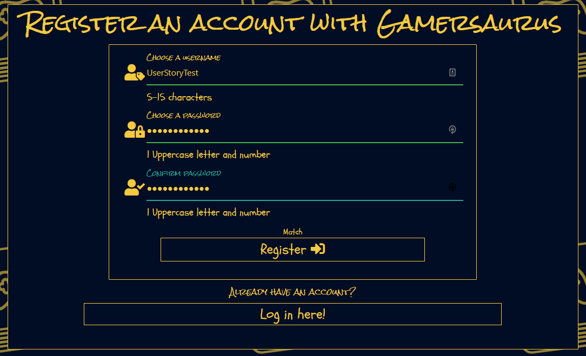

## Testing

### Code Validators

I used [w3.org's validator](https://validator.w3.org) for my HTML validation checks.

+ All pages:

    

I used [w3.org's validator](https://jigsaw.w3.org/css-validator/) for my CSS validation checks.

+ CSS (style.css)

    

+ No errors were found within the document.

I used [JSHint](https://jshint.com) to check the javascript file in my project to make certain it complies with coding standards and that were no syntax errors detected.

+ Javascript file (script.js) - When testing my code with JSHint I was getting numerous errors about const, let and using template literal syntax. I researched it and found [this post](https://stackoverflow.com/questions/27441803/why-does-jshint-throw-a-warning-if-i-am-using-const) which taught me I needed to tell JSHint what es version I was using with the following code ```/*jshint esversion: 6 */``` which fixed those errors.
    + The only other error I was receiving was from ```$``` as it was flagged as an undefined variable. Upon researching I found [this post](https://stackoverflow.com/questions/8852765/jshint-and-jquery-is-not-defined) which taught me I needed to tell JSHint that I was using jQuery with the following code ```/*globals $:false */``` which fixed those errors.
    + After putting those two lines of code at the top of my JSHint tests, I only received an error about emailjs being an undefined variable.

        

    + I consulted with a few members of the [Code Institute](https://codeinstitute.net/) Slack community about this and I have found out it is not an error; it is that jsHint does not recognize it as it is defined in the base.html file. As such my code passed with no errors.


I used [PEP8 online](http://pep8online.com/) to test my Python code against PEP8 standards.


+ No errors were found within the document.

### Responsiveness

Responsiveness (website layout)

|           All Pages           | Samsung 9+ | Galaxy S5  | iPhone 6/7/8 | iPhone X | iPad | iPad Pro | Desktop 1024px | Desktop >1200px |
|:-----------------------------:|------------|------------|--------------|----------|------|----------|----------------|-----------------|
| Website is  responsive >800px |     N/A    |    N/A     |      N/A     |    N/A   | Good |   Good   |      Good      |       Good      |
| Website is  responsive <799px |    Good    |    Good    |     Good     |   Good   |  N/A |    N/A   |       N/A      |       N/A       |
|                               |            |            |              |          |      |          |                |                 |
| **index.html**                |            |            |              |          |      |          |                |                 |
| Links/URLs                    |    Good    |    Good    |     Good     |   Good   | Good |   Good   |      Good      |      Good       |
| Images                        |    Good    |    Good    |     Good     |   Good   | Good |   Good   |      Good      |      Good       |
| Renders as expected           |    Good    |    Good    |     Good     |   Good   | Good |   Good   |      Good      |      Good       |
|                               |            |            |              |          |      |          |                |                 |
| **gamersaurus.html**          |            |            |              |          |      |          |                |                 |
| Links/URLs                    |    Good    |    Good    |     Good     |   Good   | Good |   Good   |      Good      |      Good       |
| Images                        |    Good    |    Good    |     Good     |   Good   | Good |   Good   |      Good      |      Good       |
| Renders as expected           |    Good    |    Good    |     Good     |   Good   | Good |   Good   |      Good      |      Good       |
|                               |            |            |              |          |      |          |                |                 |
| **login.html**                |            |            |              |          |      |          |                |                 |
| Links/URLs                    |    Good    |    Good    |     Good     |   Good   | Good |   Good   |      Good      |      Good       |
| Images                        |    Good    |    Good    |     Good     |   Good   | Good |   Good   |      Good      |      Good       |
| Renders as expected           |    Good    |    Good    |     Good     |   Good   | Good |   Good   |      Good      |      Good       |
|                               |            |            |              |          |      |          |                |                 |
| **register.html**             |            |            |              |          |      |          |                |                 |
| Links/URLs                    |    Good    |    Good    |     Good     |   Good   | Good |   Good   |      Good      |      Good       |
| Images                        |    Good    |    Good    |     Good     |   Good   | Good |   Good   |      Good      |      Good       |
| Renders as expected           |    Good    |    Good    |     Good     |   Good   | Good |   Good   |      Good      |      Good       |
|                               |            |            |              |          |      |          |                |                 |
| **profile.html**              |            |            |              |          |      |          |                |                 |
| Links/URLs                    |    Good    |    Good    |     Good     |   Good   | Good |   Good   |      Good      |      Good       |
| Images                        |    Good    |    Good    |     Good     |   Good   | Good |   Good   |      Good      |      Good       |
| Renders as expected           |    Good    |    Good    |     Good     |   Good   | Good |   Good   |      Good      |      Good       |
|                               |            |            |              |          |      |          |                |                 |
| **add_term.html**             |            |            |              |          |      |          |                |                 |
| Links/URLs                    |    Good    |    Good    |     Good     |   Good   | Good |   Good   |      Good      |      Good       |
| Images                        |    Good    |    Good    |     Good     |   Good   | Good |   Good   |      Good      |      Good       |
| Renders as expected           |    Good    |    Good    |     Good     |   Good   | Good |   Good   |      Good      |      Good       |
|                               |            |            |              |          |      |          |                |                 |
| **edit_term.html**            |            |            |              |          |      |          |                |                 |
| Links/URLs                    |    Good    |    Good    |     Good     |   Good   | Good |   Good   |      Good      |      Good       |
| Images                        |    Good    |    Good    |     Good     |   Good   | Good |   Good   |      Good      |      Good       |
| Renders as expected           |    Good    |    Good    |     Good     |   Good   | Good |   Good   |      Good      |      Good       |
|                               |            |            |              |          |      |          |                |                 |
| **contact.html**              |            |            |              |          |      |          |                |                 |
| Links/URLs                    |    Good    |    Good    |     Good     |   Good   | Good |   Good   |      Good      |      Good       |
| Images                        |    Good    |    Good    |     Good     |   Good   | Good |   Good   |      Good      |      Good       |
| Renders as expected           |    Good    |    Good    |     Good     |   Good   | Good |   Good   |      Good      |      Good       |
|                               |            |            |              |          |      |          |                |                 |
| **404.html**                  |            |            |              |          |      |          |                |                 |
| Links/URLs                    |    Good    |    Good    |     Good     |   Good   | Good |   Good   |      Good      |      Good       |
| Images                        |    Good    |    Good    |     Good     |   Good   | Good |   Good   |      Good      |      Good       |
| Renders as expected           |    Good    |    Good    |     Good     |   Good   | Good |   Good   |      Good      |      Good       |

Notes:

+ Through the use of Materialize and my own design input the site is responsive on all screen sizes that I have tested personally. There may be slight issues on certain abstract displays that might need additional media queries as I experienced minor issues in the development of the project pertaining to content being too big for the viewport in very extreme cases.

### Browser Compatibility

I tested the appearance and responsiveness of the website across 6 different browsers and varying browser sizes and these are my results:

|    All Pages   | Firefox | Chrome |  IE  | Edge | Opera | Safari |
|:--------------:|:-------:|:------:|:----:|:----:|:-----:|:------:|
| Appearance     |   Good  |  Good  | Good | Good |  Good |  Good  |
| Responsiveness |   Good  |  Good  | Good | Good |  Good |  Good  |

### Testing User stories

+ #### User goals

    + As a **user**, I want to be able to view all the terms currently added.
        + I have created the Terms page (gamersaurus.html) which includes a collapsible accordion that contains all terms currently added to the site.

            _Terms List_
            
        + When a user taps/clicks on a term it expands to show the information stored in the database.

            _Example of Term info_
            

    + As a **user**, I want to understand the main purpose of the site.
        + I have added an introductory description on the landing page of the site.

            _Landing page_
            
    + As a **user**, I want to be able to intuitively navigate through the site.
        + I have included a list of navigation links in the header of "base.html"
            
            _Header_
            

        + All the buttons contain text pertaining to their action (Add term, Edit Term, Delete, Submit) and perform the correct action.
        + The footer contains external links for the brands socials and opens in a new tab for user retention.
            
            _Footer_
            

    + As a **user**, I want to be able to make my own account and submit terms to the site.
        + I have included a register page (register.html) which allows the user to register for an account.

            _Register_
            

        + Upon filling out valid information in the form the user will be redirected to their newly created profile and flashed a message to confirm their registration success.

            _Success_
            

    + As a **user**, I want to be able to contact the site owner with any queries I have regarding the site.
        + I have included a contact page (contact.html) which allows the user to contact the site owner.

        _Contact_
            

        + Upon filling out valid information in the form the user will have their form inputs cleared and the submit button text changed to confirm a successful query.

            _Success_
            

+ #### Registered User Goals

    + As a **registered user**, I want to be able to log in and out of my account.
        + I have included a login page (login.html) which contains a form allowing the user to enter their login details.
            + Image placeholder
        + Once the user is logged in the "Login" link in the navbar is swapped for the "Logout" link.
            + Image placeholder
    + As a **registered user**, I want to be able to submit terms of my own to the site.
        + When the user is logged into their account an "Add Term" link is added to the navigation menu and on the "Terms" page before Search/Reset.
            + Image placeholder navbar
            + Image placeholder termcontrol
        + This feature can also be accessed on the user's profile page.
            + Image placeholder profile
    + As a **registered user**, I want to be able to edit any terms I have submitted to the site.
        + When the user is logged into their account, two icons appear on **only** terms they have submitted to the Gamersaurus on the "Terms" page.
            + Image placeholder icons term
        + If the user wishes to only see their terms in the list they can use the "Profile" page.
            + Image placeholder icons profle
        + The first is an "Edit" icon.
            + Image placeholder edit icon
        + Upon clicking the icon the user is brought to the "Edit Term" page which allows them to edit any terms provided they pass the form validation.
            + Image placeholder edit screen
    + As a **registered user**, I want to be able to delete any terms I have submitted to the site.
        + When the user is logged into their account, two icons appear on **only** terms they have submitted to the Gamersaurus on the "Terms" page.
        + The second is a "Delete" icon.
            + Image placeholder delete icon
        + Upon clicking the icon the user initiates a delete confirmation modal for term selected which allows them to confirm or cancel the deletion of the selected term.
            + Image placeholder delete screen

+ #### Site Owner Goals

	+ As a **site owner**, I want to provide the user with the essential information required to understand the site's purpose.
        + The description on the landing page of the site achieves this.

            _Landing page_
            

	+ As a **site owner**, I want the user to be able to navigate to other areas of the site.
        + The header in "base.html" provides all links and has templating to ensure users only have access to pages/features they should.
            
            _Header_
            
        
        + The header collapses into a mobile side nav on small devices to ensure users can always access it.

            _Mobile Nav_ 
            
            
        + All the buttons contain text pertaining to their action (Add term, Edit Term, Delete, Submit) and perform the correct action which allow for intuitive navigation.
	+ As a **site owner**, I want the user to be able to view the thesaurus without having an account.
        + On the Terms page (gamersaurus.html) which is **accessible to all users** there is a collapsible accordion that contains all terms currently added to the site.

            _Terms List_
            
        + When a user taps/clicks on a term it expands to show the information stored in the database.

            _Example of Term info_
            

	+ As a **site owner**, I want the user to be able to seemlessly make an account and submit terms to the site.
        + Upon loading the website the user is presented with Home (index.html) which contains a paragraph with register and login links highlighted.

            _Home Paragraph_
            

        + Once creating an account and logging in the user is redirected to their profile which contains an "Add Term" button allowing for mininal steps for the users to submit their own terms.

            _Profile Add Term_
            

	+ As a **site owner**, I want the user to be able to edit and delete terms they have added.
	+ As a **site owner**, I want to include links to the associated socials for the product.
        + In the footer I have included three links to the associated socials (Twitter/YouTube/Instagram)

            _Social Media Links_
            

### Additional Testing

**General Testing**:
+ All navigation buttons (including navbar and mobile links) redirect the user to the correct page in the site
+ All buttons produce the desired effect
+ External links open in a new tab/window and link to the correct site
+ Images load properly
+ Contact form correctly submits information and informs the user of the response

**Site content Testing**:
+ **Users who are not logged in**:
    + Are able to:
        + Register an account provided the username is not already taken.
        + View the Terms, Register, Login and Contact pages.
    + Are not able to:
        + Access Add, Edit, Delete or Profile pages.
        + Access Add/Edit/Delete buttons in various pages.

+ **Users who are logged in**:
    + Are able to:
        + Logout of their account.
        + View the Terms, Profile, Add, Edit, Logout and Contact pages.
        + View all the terms they have added in their profile page.
        + Add, Edit and Delete terms they have created on both Terms and their Profile.
    + Are not able to:
        + Edit/Delete terms other users have added.
        + Access Login page.

**User called "Admin"**:
+ Is able to Edit/Delete any terms on the site.

**Validation**:
+ Form validation works throughout the site.
    + Add term, Edit term and Contact.

**Flash Messages**:
+ Flash messages appear correctly when a user has:
    + Successfully registered an account
    + Registered with a username already in use
    + Successfully logged in to their account
    + Successfully logged out of their account
    + Entered an incorrect username/password combination
    + Successfully added a word to the Gamersaurus
    + Successfully edited a word in the Gamersaurus
    + Successfully deleted a word in the Gamersaurus
    + Attempted to add a term already in the Gamersaurus

### Bugs

+ **Search Feature** - When trying to implement this feature I had set up my index key wrong producing a multitude of errors. I was using this piece of code:

    ```mongo.db.gamersaurus.create_index([("term", "text"), ("definition", "text"), ("example", "text")])```

    + What this ended up doing was creating a collection called "gamersaurus" within my database and applying the index to that. What I needed to use was this:

    ```mongo.db.thesaurus.create_index([("term", "text"), ("definition", "text"), ("example", "text")])```
    
    + This created the index in the appropriate location and my search function worked as intended.

+ **Buttons in Term Control** - I added a container for the search feature and decided to include an "Add Term" button with an if/else loop to manage the responsive styling.
    + My first attempt had the if/else loop containing the two different divs but this affected the form submission. 
        + To solve this I used jinja templating to change the top level divs for s4 and s6 based on ``````.
    + In an attempt to make the buttons the same size I converted my a tags to buttons but ran into issues with the form submission.
        + To solve this I changed my buttons back to a links and added the class of "button" to them which produced the same effect and a functioning site.

+ **Contact Bug** - This minor bug occurs when submitting a message in the contact form that is over 1 line in length.
    + Upon selecting the input field again it returns to it's intended size.

        _Contact Message_
        

[Return to README.md](README.md).